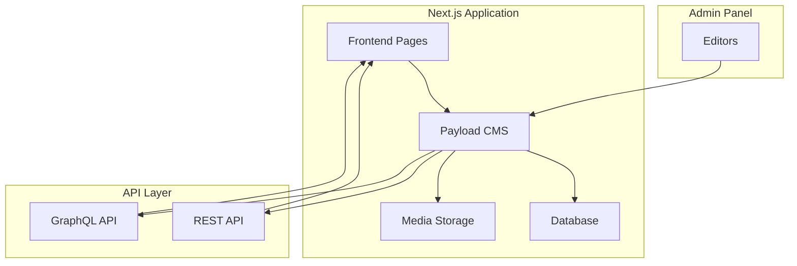

# CMS Backend Options for MKG Summit

## Project Context

- **Current Stack**: Next.js 16.1.6, React 19, TypeScript, Tailwind CSS 4
- **Requirements**: Self-hosted, event content management (speakers, sponsors, schedule), mixed team (developers + editors)
- **Package Manager**: pnpm

---

## Top CMS Options Comparison

### 1. Payload CMS ⭐ RECOMMENDED

**Why it's the best fit for your project:**

| Aspect | Details |
|--------|---------|
| **Next.js Integration** | Native - built specifically for Next.js, runs as a Next.js app |
| **TypeScript** | First-class support, auto-generates types from your schema |
| **Database** | MongoDB, PostgreSQL, SQLite (you choose) |
| **Admin UI** | Fully customizable React-based admin panel |
| **Self-hosted** | 100% - you own everything |
| **Editor Experience** | Modern Lexical editor, great for non-technical users |

**Key Advantages for Your Use Case:**
- Seamlessly integrates into your existing Next.js project
- Code-first approach - define schemas in TypeScript
- Excellent for relational content (speakers → sessions → sponsors)
- React components can be used in the admin panel
- Vercel-friendly deployment

**Code Example - Speaker Collection:**
```typescript
// payload.config.ts
import { buildConfig } from 'payload'
import { mongooseAdapter } from '@payloadcms/db-mongodb'

export default buildConfig({
  collections: [
    {
      slug: 'speakers',
      fields: [
        { name: 'name', type: 'text', required: true },
        { name: 'bio', type: 'richText' },
        { name: 'photo', type: 'upload', relationTo: 'media' },
        { name: 'company', type: 'text' },
        { name: 'sessions', type: 'relationship', relationTo: 'sessions', hasMany: true },
      ],
    },
    {
      slug: 'sponsors',
      fields: [
        { name: 'name', type: 'text', required: true },
        { name: 'logo', type: 'upload', relationTo: 'media' },
        { name: 'tier', type: 'select', options: ['platinum', 'gold', 'silver'] },
        { name: 'website', type: 'text' },
      ],
    },
  ],
})
```

---

### 2. Strapi

**The established open-source choice:**

| Aspect | Details |
|--------|---------|
| **Next.js Integration** | Good - REST/GraphQL APIs work well with Next.js |
| **TypeScript** | Supported (v5 has improved TS support) |
| **Database** | PostgreSQL, MySQL, SQLite |
| **Admin UI** | Polished, customizable admin panel |
| **Self-hosted** | Yes - fully open source |
| **Editor Experience** | Excellent for non-technical users |

**Pros:**
- Largest community and ecosystem
- Extensive plugin marketplace
- Mature and battle-tested
- Great documentation

**Cons:**
- Separate application (not integrated into Next.js)
- More opinionated about structure
- Per-seat pricing for cloud (if you ever need it)

---

### 3. Directus

**Database-first approach:**

| Aspect | Details |
|--------|---------|
| **Next.js Integration** | Good - REST/GraphQL APIs |
| **TypeScript** | Auto-generates types |
| **Database** | Any SQL database - wraps existing DBs |
| **Admin UI** | Vue.js-based admin panel |
| **Self-hosted** | Yes - fully open source |
| **Editor Experience** | Good, but more technical |

**Pros:**
- Connect to existing databases
- No migration needed if you have data
- Real-time API layer
- Great for complex relational data

**Cons:**
- Separate application
- Vue.js admin (if you prefer React ecosystem)
- More setup complexity

---

### 4. Sanity

**Real-time collaboration focus:**

| Aspect | Details |
|--------|---------|
| **Next.js Integration** | Excellent - official Next.js integration |
| **TypeScript** | Good support with generated types |
| **Database** | Proprietary (managed) |
| **Admin UI** | Highly customizable React-based studio |
| **Self-hosted** | ⚠️ Studio can be self-hosted, but data is cloud-only |
| **Editor Experience** | Excellent real-time collaboration |

**Pros:**
- Real-time collaborative editing
- Great content studio
- Excellent for editorial teams
- GROK query language is powerful

**Cons:**
- Not fully self-hosted (data lives in their cloud)
- Pricing scales with usage
- Vendor lock-in concerns

---

## Decision Matrix

| Criteria | Payload | Strapi | Directus | Sanity |
|----------|---------|--------|----------|--------|
| Next.js Integration | ⭐⭐⭐⭐⭐ | ⭐⭐⭐⭐ | ⭐⭐⭐⭐ | ⭐⭐⭐⭐⭐ |
| TypeScript Native | ⭐⭐⭐⭐⭐ | ⭐⭐⭐ | ⭐⭐⭐⭐ | ⭐⭐⭐⭐ |
| Self-hosted | ⭐⭐⭐⭐⭐ | ⭐⭐⭐⭐⭐ | ⭐⭐⭐⭐⭐ | ⭐⭐ |
| Editor UX | ⭐⭐⭐⭐ | ⭐⭐⭐⭐⭐ | ⭐⭐⭐ | ⭐⭐⭐⭐⭐ |
| Developer UX | ⭐⭐⭐⭐⭐ | ⭐⭐⭐⭐ | ⭐⭐⭐⭐ | ⭐⭐⭐⭐ |
| Community Size | ⭐⭐⭐ | ⭐⭐⭐⭐⭐ | ⭐⭐⭐ | ⭐⭐⭐⭐ |
| Relational Data | ⭐⭐⭐⭐⭐ | ⭐⭐⭐⭐ | ⭐⭐⭐⭐⭐ | ⭐⭐⭐ |

---

## Recommendation: Payload CMS

**Why Payload is ideal for MKG Summit:**

1. **Seamless Integration**: Payload runs inside your Next.js app - no separate backend to deploy and maintain

2. **TypeScript-First**: Auto-generated types mean your frontend and CMS are always in sync

3. **Perfect for Event Content**: 
   - Speakers → Sessions (relationships)
   - Sponsors → Tiers (select fields)
   - Schedule → Time slots (complex nested structures)

4. **Editor-Friendly**: Non-technical team members get a clean, modern admin panel

5. **Future-Proof**: 
   - Used by Microsoft, Disney, Bugatti
   - Active development and growing community
   - Can deploy to Vercel, Docker, or any Node.js host

---

## Architecture Overview



---

## Next Steps

If you choose to proceed with Payload CMS, the implementation would involve:

1. Install Payload and database adapter
2. Create payload.config.ts with collections for speakers, sponsors, sessions
3. Configure admin panel customization
4. Set up media upload handling
5. Integrate with existing Next.js pages
6. Deploy configuration

Would you like me to create a detailed implementation plan for Payload CMS?
